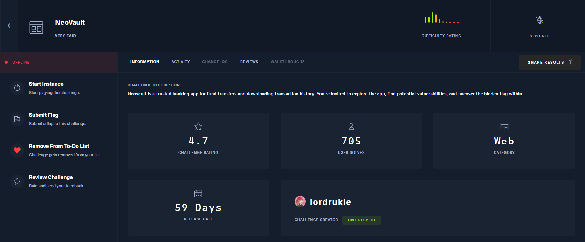
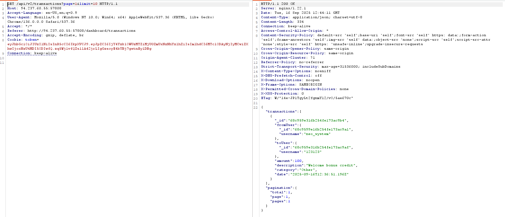
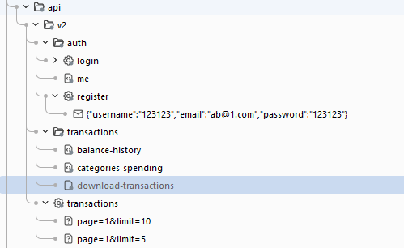
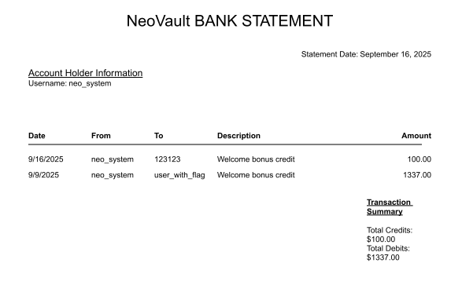
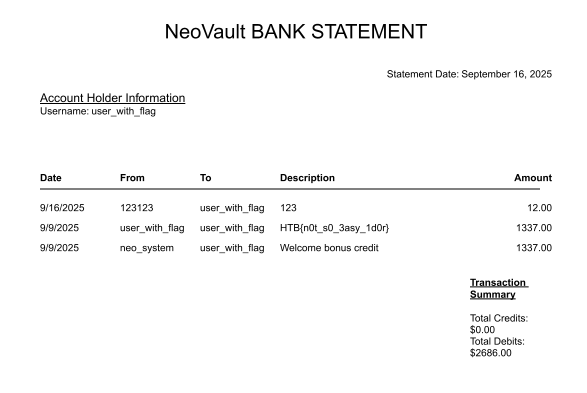

# 🏴‍☠️ CTF Writeup – [NeoVault]

## 📌 Thông tin chung
- **Challenge:** NeoVault 
- **CTF Event:** HackTheBox Challenges  
- **Category:** Web 
- **Difficulty:** Very Easy 

---

## 📜 Mô tả đề bài
> Neovault is a trusted banking app for fund transfers and downloading transaction history. You're invited to explore the app, find potential vulnerabilities, and uncover the hidden flag within.
- File/URL cung cấp: [Thử thách](https://app.hackthebox.com/challenges/NeoVault) 
- Thông tin thử thách : 

---

## 🔎 Recon / Ý tưởng ban đầu
- Quan sát ban đầu: Trang web mô phỏng ví điện tử với các chức năng:
    - Tổng quan tài chính: Thu nhập, chi tiêu, tổng số tiền hiện tại, lịch sử 
    - Chuyển tiền
    - Tiền gửi (Đang trạng thái bảo trì)
    - Lịch sử giao dịch (Có thể download PDF lịch sử giao dịch)
    - Cập nhật thông tin
- Các thử nghiệm đầu tiên:  
    - Khi tương tác với các chức năng dễ kiểm tra không thực sự chức năng nào có ích.
    - Phân tích các request 
    
    - Ở đây có để lộ thông tin `_id` người gửi 
    
    - Ở đây có thể thấy `v2` là số phiên bản của api, có thể kiểm tra `v1`
    - Sau khi kiểm tra các endpoint tổng hợp được các api có `v2` sau:
        - /api/v2/transactions/download-transactions
        - /api/v2/auth/me
        - /api/v2/transactions?page=1&limit=10
        - /api/v2/transactions/balance-history
        - /api/v2/transactions/categories-spending
    
    - Với các endpoint trên, sửa thành v1 để tìm kết quả:
        - Hầu hết kết quả thu được là: 
        ```json
        {"message":"API v1 is deprecated, please use the new one instead"}
        ```
        - Tuy nhiên có endpoint `/api/v2/transactions/download-transactions` yêu cầu cung cấp `_id`
- Kết quả/ghi chú:  
    - Kết hợp từ việc để lộ giá trị `_id` cùng với download lịch sử giao dịch từ `_id` ta có thể tạo ra 1 vector tấn công hoàn chỉnh
---

## 🧩 Phân tích
- Giải thích lỗ hổng / kỹ thuật chính: Lỗ hổng từ việc lộ giá trị định danh tài khoản `_id` cùng với phiên bản cũ của api. 
- Tại sao có thể khai thác: Hệ thống chưa tắt hoàn toàn việc sử dụng API cũ là lỗi chính, đông thời thông tin chuyển khoản hiển thị cả những thông tin nhạy cảm

---

## 🚀 Khai thác / Giải pháp
- Các bước exploit:  
    - Thu thập `_id` của Neo_system
    ```json
    {"_id":"68c9599e16b254fe173ac9a1","username":"neo_system"}
    ```
    - Lấy lịch sử giao dịch từ `_id`
    
    - Tìm `_id` của `user_with_flag` bằng cách chuyển khoản có người dùng đó
    ```json
    {"_id":"68c9599f16b254fe173ac9a6","username":"user_with_flag"}
    ```
    - Lấy lịch sử giao dịch của `user_with_flag`
    
