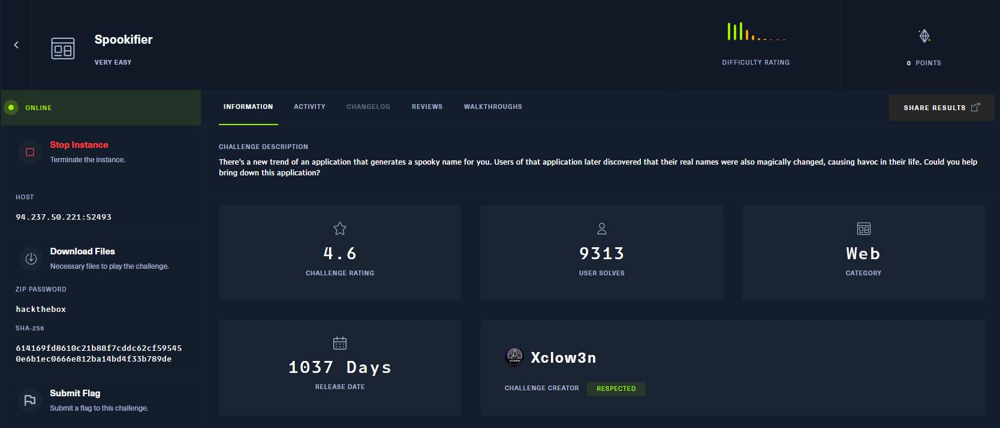
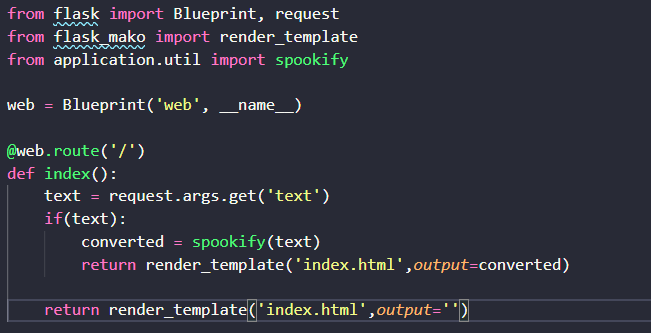
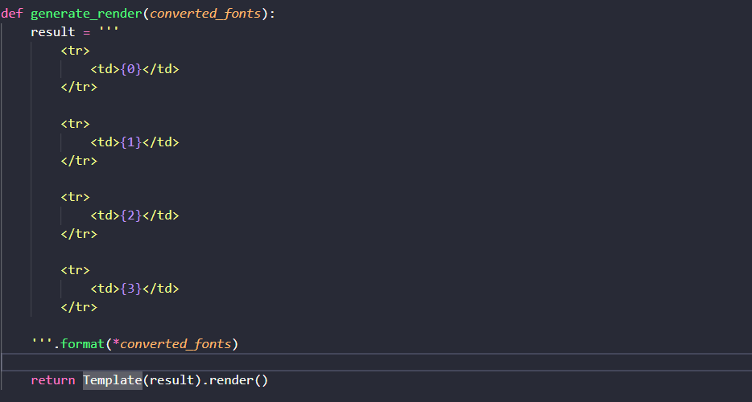
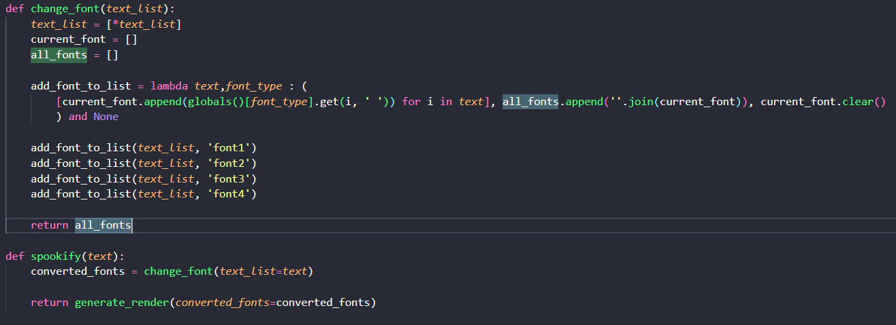
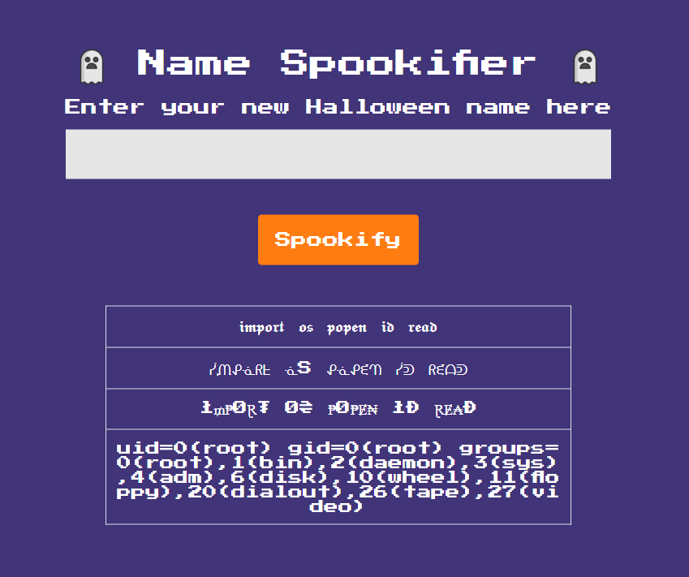
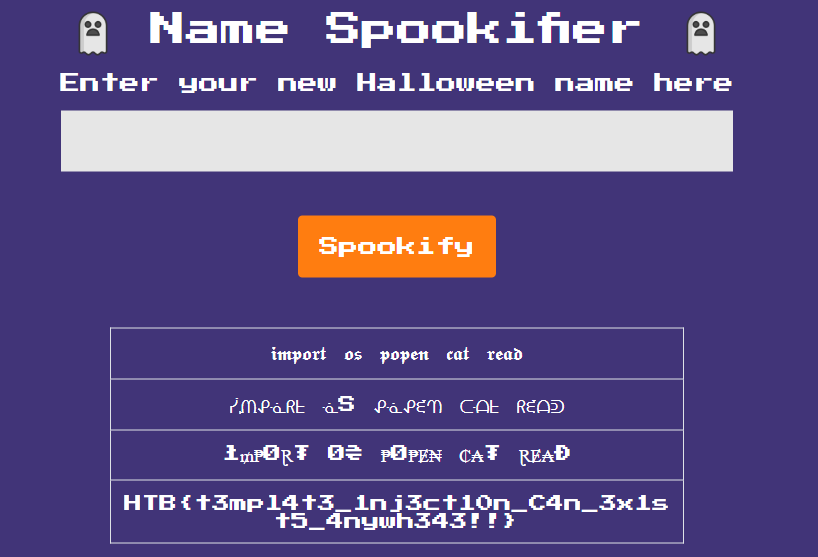

# 🏴‍☠️ CTF Writeup – [Spookify]

## 📌 Thông tin chung
- **Challenge:** Spookify
- **CTF Event:** HackTheBox Challenges 
- **Category:** Web 
- **Difficulty:** Very Easy  

---

## 📜 Mô tả đề bài
> There's a new trend of an application that generates a spooky name for you. Users of that application later discovered that their real names were also magically changed, causing havoc in their life. Could you help bring down this application?
- File/URL cung cấp: [Thử thách](https://app.hackthebox.com/challenges/Spookifier) 
- Thông tin thử thách :  

---

## 🔎 Recon / Ý tưởng ban đầu
- Quan sát ban đầu: Thử thách whitebox, sử dụng python
- Các thử nghiệm đầu tiên: 
    - Review src code:
        - Trang web với chức năng chính nhập vào `text` sau đó hiển thị ra với 4 loại font khác nhau

        `routes.py`
        
        - Kiểm tra nội dung file `util.py` để xem cách thực hiện của server.

        `util.py`
        - Sử dụng template Mako để render 
        
        - Lấy trực tiếp kết quả results làm đầu vào mà không có lọc 
        
        
- Kết quả/ghi chú:  Trang web lấy toàn bộ đầu vào người dùng sau đó đổi sang thành 4 loại font khác nhau và sử dụng Mako Template render trực tiếp.

---

## 🧩 Phân tích
- Giải thích lỗ hổng / kỹ thuật chính: Với phân tích từ trên, có thể dễ dàng thấy trang web đang mắc lỗ hổng nghiêm trọng gây ra RCE là `Server-side template injection` 
- Tại sao có thể khai thác: Với đầu vào trực tiếp và không hề có bộ lọc, chính vì thế dữ liệu nhập vào hoàn toàn được kiểm soát bới người dùng
---

## 🚀 Khai thác / Giải pháp
- Các bước exploit:  
    - Payload:
        ```python
        ${__import__('os').popen('id').read()}
        ```
    - Kết quả thu được:
        
    - Đọc flag
        ```python
        ${__import__('os').popen('cat /*').read()}
        ```    
        