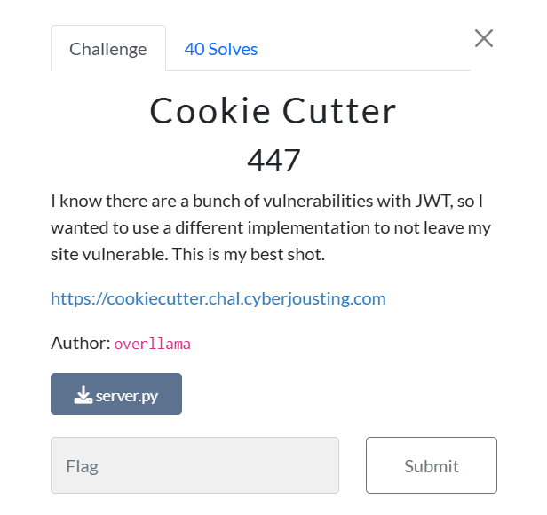

# Cookie Cutter


Đọc src code từ server.py mình có thể tóm tắt nội dung của web này như sau:

1. Nhập email
2. Tạo cookie bằng cách mã hóa AES chuỗi 
```python
f"email={self.email}&uid={self.uid}&role={self.role}"
```
Mục tiêu của phải tìm được cookie với role=admin

Để làm được điều đó ta chèn các pad vào để tạo được các khối độc lập sau đó với email tạo ra block "admin"

Lý thuyết đã đủ giờ vào thực hành :33

Đầu tiên sử dụng Burp Suite để có thể điều chỉnh dễ hơn

    Với email = "aaaa" ta nhận được cookie = "Hnx8smkX66rifAdpLGUR+TQoLMX1nFyLcFwkWq5zH/I=" 
    Với email = "aaaaa" ta nhận được cookie = "tbm/+6KBnGMHhv+Md8QfRCJn1QnJTaGR5QoEhZOW1FyYtylnf9GMtC3p2dZ4ypHy"

Dễ thấy với "aaaaa" đã đủ để đổ dài chuỗi mã hóa chia hết cho 16
tiếp đến chèn để lấy thông tin "admin"

    Để làm được ta cần tạo ra một block "admin%0b%0b%0b%0b%0b%0b%0b%0b%0b%0b%0b"

    Chuõi "email=" có 6 bytes ta sẽ đệm thêm 10 bytes nữa từ đây ta sẽ truyền vào email="aaaaaaaaaaadmin%0b%0b%0b%0b%0b%0b%0b%0b%0b%0b%0b"
    cookie = "igTdKhoT0Nq7JgwqfeZv0MNgJlK8NM8+EF4nlqJKjPxIFPdnMxFpCBRQS/aJA2/koIx2jhXn0L3fui/S4+kzmQ=="
    
```python
import base64

cookie ="igTdKhoT0Nq7JgwqfeZv0Agk8xEDIPNBzLxU/J4GiwaiInXkp721S9fDB2RJJlPllLZxO/z7LELFE6EyTXxG9A=="
data = base64.b64decode(cookie)[16:32]
# data = chuỗi "admin" được mã hóa"
```

Bây giờ chỉ cần tạo một chuỗi bình thường sau đó nhét thêm data vào là được 
    
    Ta sẽ phải truyền vào email=aaaaaaaaa
    cookie = "GL6quWnT3WdBFYqa3QJpCHs3LD7JNX/fDuZ2YQJZBZeB4cO2+HHdULlOL8+D3o8+"

Sau đó tách các khối cần thiếp để cuối ra được cookie cần tìm
# Solve
```python
import base64

cookie ="igTdKhoT0Nq7JgwqfeZv0Agk8xEDIPNBzLxU/J4GiwaiInXkp721S9fDB2RJJlPllLZxO/z7LELFE6EyTXxG9A=="
data = base64.b64decode(cookie)[16:32]
cookie ="GL6quWnT3WdBFYqa3QJpCOVsRQap8ZojGk7KOp5P2b6B4cO2+HHdULlOL8+D3o8+"
data2= base64.b64decode(cookie)[:-16]
cookie = data2+data
print(base64.b64encode(cookie))
```
