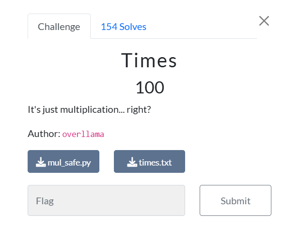

# Times


Đây là một bài sử dụng Elliptic curve

Để làm được ta cần tìm hiểu một chút về Elliptic curve [Tại đây](https://en.wikipedia.org/wiki/Elliptic_curve)

Bây giờ ta cần viết hàm nhân và hàm cộng 

## Hàm nhân (Nhân đôi)
```python
# Ở đây từ P sẽ tính được 2P
def Ellip(x,y):
    global n
    tu = 3*pow(x,2)  + 13
    mau = pow(2*y,-1,n)
    lamda = (tu*mau)%n
    x3 = (lamda**2 - 2*x)%n
    y3 = (lamda*((x-x3)%n) - y)%n
    return x3,y3 
```
## Hàm cộng
```python
# Ở đây sẽ tính aP+bP=(a+b)P
def sum(x1,y1,x2,y2):
    global n
    lamda = ((y2-y1)*pow(x2-x1,-1,n))%n 
    x3 = (lamda**2 - x1 - x2)%n
    y3 = (lamda*((x1-x3)%n) - y1)%n
    return x3,y3
```

    Ở bài này tác giả chọn mốc là 
    P(x = 14592775108451646097;y = 237729200841118959448447480561827799984) 
    
    Và biểu thức là Curve:  y^2 = x**3 + 13x + 245 % 335135809459196851603485825030548860907

Giờ việc chúng ta sẽ là tính 1337P = 1024P + 256P+ 32P+16P+8P+P

# Solve
```python
import base64
import hashlib
from Crypto.Cipher import AES 
cipher = b'SllGMo5gxalFG9g8j4KO0cIbXeub0CM2VAWzXo3nbIxMqy1Hl4f+dGwhM9sm793NikYA0EjxvFyRMcU2tKj54Q=='
iv = b'MWkMvRmhFy2vAO9Be9Depw=='
cipher = base64.b64decode(cipher)
iv = base64.b64decode(iv)
n = 335135809459196851603485825030548860907
def bol(x,y):
    global n
    if (pow(x,3)+13*x + 245 -pow(y,2))% n == 0: return True
    return False
def Ellip(x,y):
    global n
    tu = 3*pow(x,2)  + 13
    mau = pow(2*y,-1,n)
    lamda = (tu*mau)%n
    x3 = (lamda**2 - 2*x)%n
    y3 = (lamda*((x-x3)%n) - y)%n
    return x3,y3 
x = 14592775108451646097
y = 237729200841118959448447480561827799984 
print(bol(x,y))
foundx = x
foundy = y
def sum(x1,y1,x2,y2):
    global n
    lamda = ((y2-y1)*pow(x2-x1,-1,n))%n 
    x3 = (lamda**2 - x1 - x2)%n
    y3 = (lamda*((x1-x3)%n) - y1)%n
    return x3,y3
for i in range(1,13):
    x,y = Ellip(x,y)
    if i in [3,4,5,8,10]:
        foundx,foundy = sum(x,y,foundx,foundy)
print(bol(foundx,foundy))
sha1 = hashlib.sha1()
sha1.update(str(foundx).encode('ascii'))
key = sha1.digest()[:16]
cipher1 = AES.new(key, AES.MODE_CBC, iv)
plaintext = cipher1.decrypt(cipher)
print(plaintext)
```
