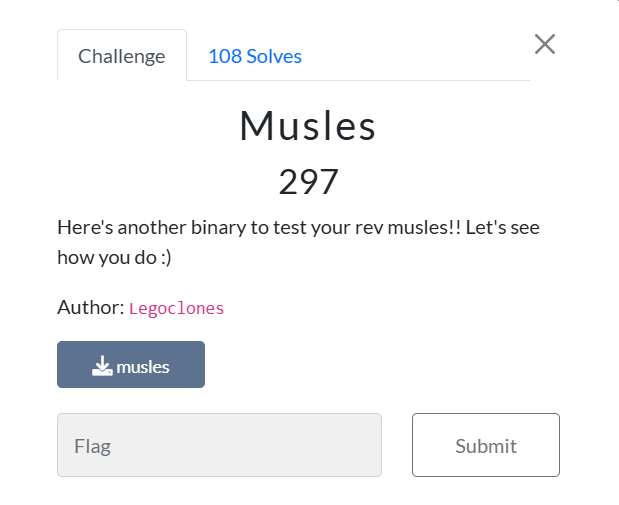

Đầu tiên kiếm tra xem file 
```bash
    Arch:     amd64-64-little
    RELRO:    Partial RELRO
    Stack:    No canary found
    NX:       NX enabled
    PIE:      PIE enabled
```

Bây giờ mở IDA x64 để decomplie chương trình 


```C++
// hàm main của chương trình
__int64 __fastcall main(int a1, char **a2, char **a3)
{
  void *dest; // [rsp+18h] [rbp-18h]
  unsigned __int64 i; // [rsp+28h] [rbp-8h]

  alarm(0xAu);
  dest = mmap(0LL, 0xF1uLL, 7, 34, -1, 0LL);
  if ( dest == (void *)-1LL )
  {
    perror("Error mapping memory");
    exit(1);
  }
  if ( !system("pidof gdb > /dev/null") )
    exit(1);
  memcpy(dest, &unk_4060, 0xF1uLL);
  for ( i = 0LL; i < 0xF1; ++i )
    *((_BYTE *)dest + i) ^= 0x20u;
  ((void (*)(void))dest)();
  if ( munmap(dest, 0xF1uLL) == -1 )
  {
    perror("Error unmapping memory");
    exit(1);
  }
  return 0LL;
}
```

Ở đây chương trình sẽ copy vùng nhớ từ &unk_4060 với độ dài là 0xF1 bytes sau đó lấy từng nội dung xor với 0x20.
Vấn đề ở đây &unk_4060 lưu trữ gì?

Khi truy cập vào cùng .data ta thấy một loạt dữ liệu từ &unk_4060


Tiếp đến ta sẽ tách toàn bộ dữ liệu và chuyển vào file data. Sau đó viết một đoạn script để xử lý data và tạo ra chuỗi như đề bài yêu cầu.
```python
s=""
with open("data","r") as f:
    for i in f:
        data = int(i,16)^0x20
        tmp = hex(data)[2:]
        s+=tmp.zfill(2)
print(s)
#48c7c00000000048c7c7000000004889e648c7c2260000000f0548b8813af218e959b48648b9e343877b9d3fcff348310c24483904240f85a50000005b48b88a39fd129eb77eee48b9f866ba56dce80d8548310c24483904240f85820000005b48b8a36a58d7d2776ad248b9ca0634a48d1618b748310c244839042475635b48b846dcc7420615678448b919aea2236a791edb4831c84839042475455b48b8c67ce3c7fc14000048b9b50b8cab9069000048310c244839042475265b48c7c00100000048c7c70100000048be436f727265637421564889e648c7c2080000000f0548c7c03c00000048c7c7000000000f05
```


```C++
((void (*)(void))dest)();
// Có thể hiểu đoạn hex bên trên chính là shellcode và được chương trình chạy
```

Từ đây phải chuyển từ shell code sang chương trình để decomplie 
```python
from pwn import *
context(os="linux", arch="amd64", log_level="error")
shellcode_hex="48c7c00000000048c7c7000000004889e648c7c2260000000f0548b8813af218e959b48648b9e343877b9d3fcff348310c24483904240f85a50000005b48b88a39fd129eb77eee48b9f866ba56dce80d8548310c24483904240f85820000005b48b8a36a58d7d2776ad248b9ca0634a48d1618b748310c244839042475635b48b846dcc7420615678448b919aea2236a791edb4831c84839042475455b48b8c67ce3c7fc14000048b9b50b8cab9069000048310c244839042475265b48c7c00100000048c7c70100000048be436f727265637421564889e648c7c2080000000f0548c7c03c00000048c7c7000000000f05"
shellcode=bytes.fromhex(shellcode_hex)
elf = ELF.from_bytes(shellcode)
elf.save("P4nd@")
```

    Bây giờ ta đã có chương trình là P4nd@ tiếp theo phải decomplie sang asm

```bash
objdump -M intel -d P4nd@
```

Sau khi decompile ta sẽ đọc asm để tìm xem shell này sẽ làm gì


Ở đây chương trình sẽ cho nhập từ ngoài vào sau đó lưu vào [rsp] sau đó lấy [rsp]^rcx và so sánh với rax nếu đúng thì tiếp tục không thì sẽ nhảy.
Tiếp tục chương trình sẽ lặp lại như trên. Từ đây ra sẽ viết script để tìm ra nội dung là gì

```python
rax = [0x86b459e918f23a81,0xee7eb79e12fd398a,0xd26a77d2d7586aa3,0x8467150642c7dc46,0x14fcc7e37cc6]
rcx = [0xf3cf3f9d7b8743e3,0x850de8dc56ba66f8,0xb718168da43406ca,0xdb1e796a23a2ae19,0x6990ab8c0bb5]
s=""
for i in range(len(rax)):
    s += str(hex(rax[i]^rcx[i])[2:])
print(bytes.fromhex(s))
#b'u{ftcuybks_BDG_rera_slli_yllaer_}llows'
# Chuỗi bị ngược là do bị lưu little endian giờ đưa vào cyber chef là được 
# byuctf{ur_GDB_skills_are_really_swoll}
```


