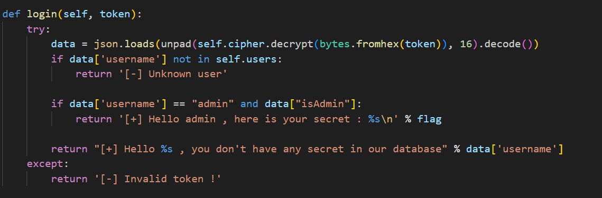
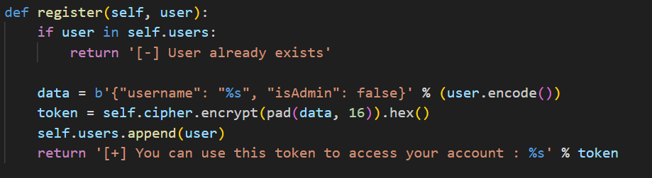
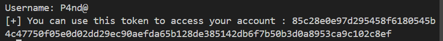
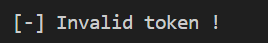
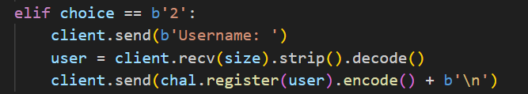
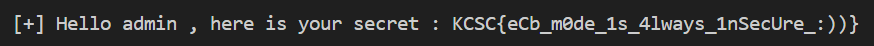

### Đọc file server.py ta thấy server có 2 chức năng chính 

## Login



Ở đây sẽ giải mã đầu vào sau đó kiểm tra 'username' và 'isAdmin'. Để có thể đọc được flag thì việc chúng ta là tìm đầu vào sao cho khi giải mã ra được chuỗi

     {"username": "admin", "isAdmin": true}

## Register



Ở đây dễ dàng nhìn thấy sau khi nhập đầu vào thì sẽ được chuyển thành chuỗi 

    b'{"username": "%s", "isAdmin": false}' % (user.encode())
Ví dụ khi đăng kí với username = "P4nd@" thì sẽ nhận được chuỗi 

    b'{"username": "P4nd@", "isAdmin": false}'

Sau đó thì lấy chuỗi nãy mã hóa ECB rồi chuyển qua hex rồi gửi lại cho người dùng



Do ở đây đầu vào được nhập tự do chính vì thế ta có thể nghĩ đến việc nhập 

    username = {"username": "admin", "isAdmin": true}'

Để làm được việc đó ta cần đếm padding để có thể không bị lỗi trong quá trình mã hóa.

Phân tích một chút: mã hóa ECB này mã hóa theo cấu trúc 16 bytes 1 khối chính vì thế ta sẽ đếm số lượng bytes và chèn thêm pad vào.

    {"username": "admin", "isAdmin": true}

Chuỗi mục tiêu gồm 38 bytes nên có 3 khối 16 bytes trong đó khối cuối thì thiếu 10 bytes để đủ khối

|Khối|Dữ liệu|
|---|---|
|1|{"username": "ad|
|2|min", "isAdmin":|
|3| true}|

    data = json.loads(unpad(self.cipher.decrypt(bytes.fromhex(token)), 16).decode())
Để không lỗi trong quá trình unpad thì chuỗi mục tiêu sẽ là 

    b'{"username": "admin", "isAdmin": true}\n\n\n\n\n\n\n\n\n\n'

Nắm được block cần mã hóa rồi giờ phải đếm bytes trước mã hóa 

    data = b'{"username": "%s", "isAdmin": false}' % (user.encode())

Để chuỗi mục tiêu được nằm hoàn toàn trong 3 block riêng biệt thì ra phải lấp đầy block 1 bằng 2 bytes nữa

vì vầy chuỗi mục tiêu bây giờ phải trở thành 
    
    b'xx{"username": "admin", "isAdmin": true}\n\n\n\n\n\n\n\n\n\n'

Bây giờ thử viết script rồi chạy xem kết quả 
```python
data = b'{"username": "admin", "isAdmin": true}'
data = b"xx"+ pad(data,16)
```

Tuy nhiên khi chạy thử lại xảy ra lỗi 



Mò ngược lại về code ta có thể thấy lỗi là do quá trình unpad, nên ta thử đọc ngược lại xem có quá trình nào nữa không



Ở đây khi nhận dữ liệu chúng ta nhập server sẽ decode() rồi strip() chính vì thế sẽ làm mất \n... của chúng ta. Để qua được strip() này ta chỉ cần thêm 1 bytes kí tự vào cuối chuỗi mục tiêu là được

``` python
data = b'{"username": "admin", "isAdmin": true}'
data = b"xx"+ pad(data,16) +b"x"
```


